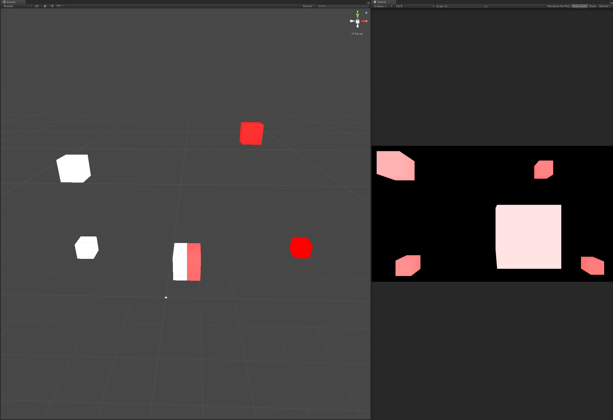

ImageEffectToSceneCamera
===

UnityのSceneViewは、内部的には以下の処理によって実現されているらしい。  
- HideFlags.HideAndDontSaveフラグの立っているGameObjecをCreateする
- そのGameObjectにCameraをAddComponentする
- 追加したCameraのRenderTargetにRenderTextureを設定する
- RenderTextureをSceneViewWindowsに表示させる（この時に、RenderTextureの上にGizmoとかを書き込んでいるっぽい）

[Github - UnityCsReference](https://github.com/Unity-Technologies/UnityCsReference/blob/master/Editor/Mono/SceneView/SceneView.cs#L2761)

なので、UnityのSceneCameraのGameObjectに自前のスクリプトをAddComponentすることによって、SceneCameraのレンダリングに対してフック処理を書くことができる。  
このプロジェクトは、OnRenderImage, OnPreRender, OnPostRenderなどがちゃんと呼ばれることを確認するためのもの。  

 

Scene ViewのX軸左半分ではエフェクトをOFFにしてる  

